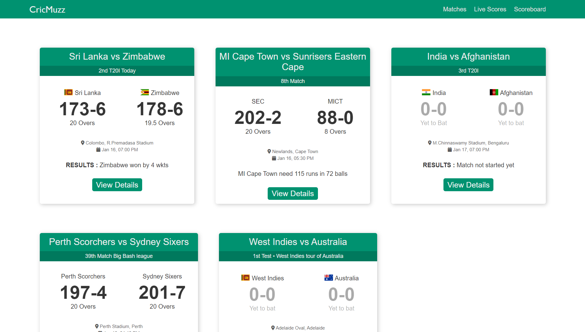
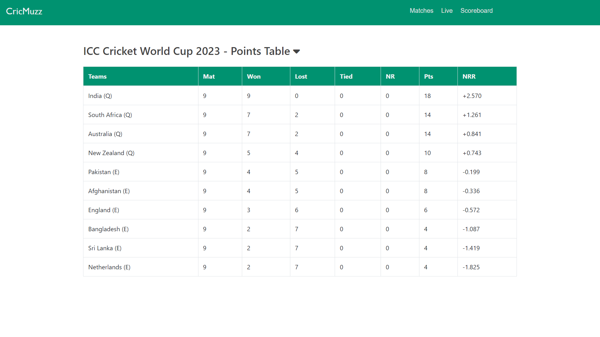
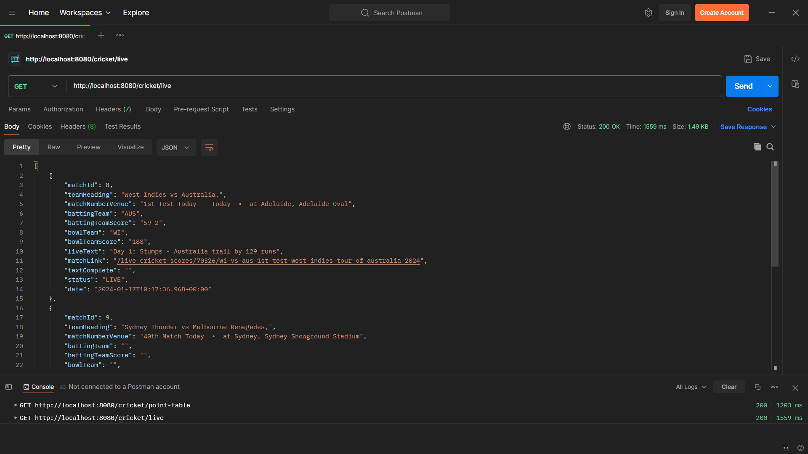

# CrickMuzz CrickBuzz clone Project

A web application displaying cricket standings using Spring Boot for the backend and collecting data with Jsoup.


_Overview of the project._

## Table of Contents

- [Overview](#overview)
- [Screenshots](#screenshots)
- [Usage](#usage)
- [Technologies Used](#technologies-used)
- [License](#license)

## Overview

This project is a web application that displays cricket standings using Spring Boot for the backend to collect data and Jsoup for web scraping. The frontend is built with HTML, CSS, and Bootstrap. The data is retrieved from a web source, processed by the backend, and presented in a tabular format on the webpage.

## Screenshots


_Overview of the project._


_Scoreboards Page._


_REST API Call using Postman._

## Usage

1. Clone the repository:

   ```bash
   git clone https://github.com/AceAbhishekOfficial/CrickMuzz.git
   ```

2. Build and run the Spring Boot application:

   ```bash
   cd your-project
   ./mvnw clean install
   ./mvnw spring-boot:run
   ```

3. Open the web browser and navigate to `http://localhost:8080`.

## Technologies Used

- Spring Boot
- Jsoup
- HTML
- CSS
- Bootstrap

## License

This project is licensed under the [MIT License](LICENSE).
